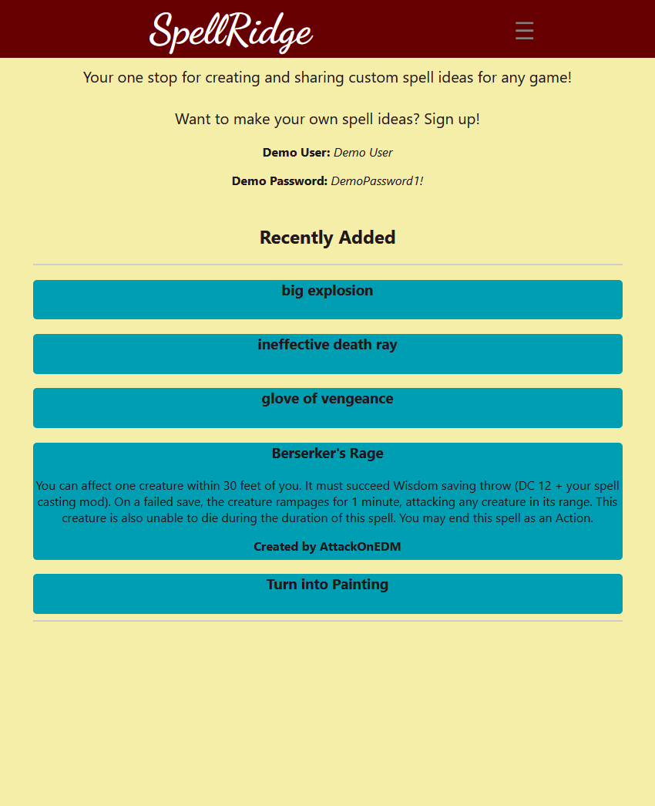
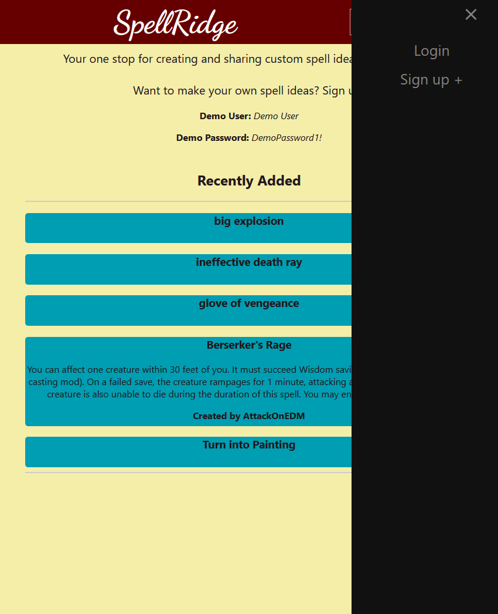
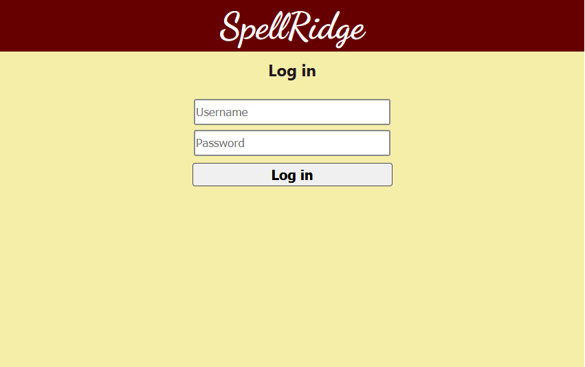
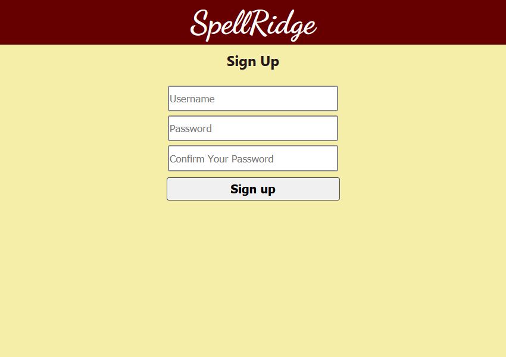
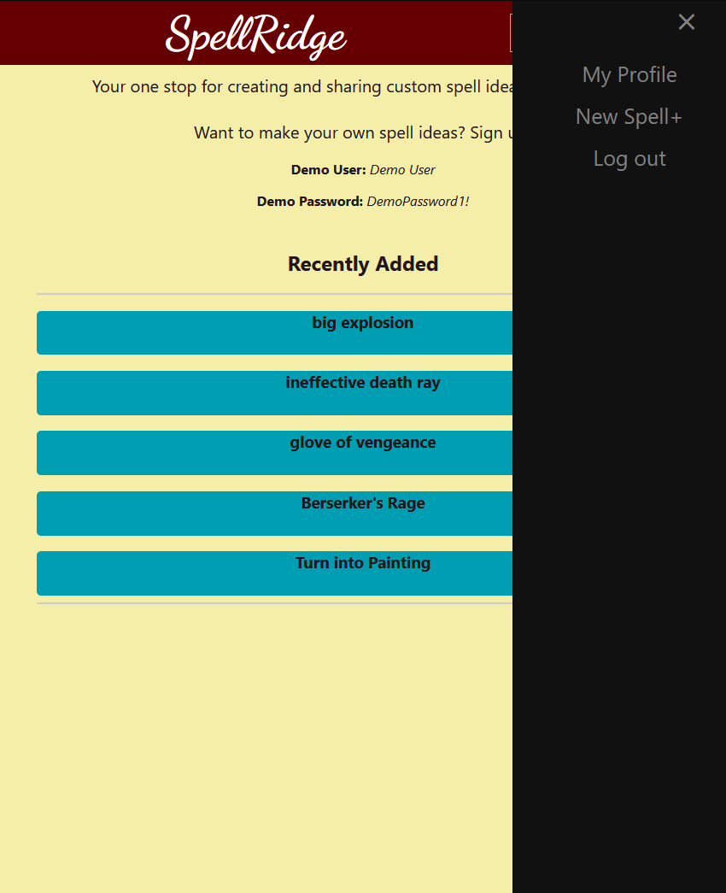
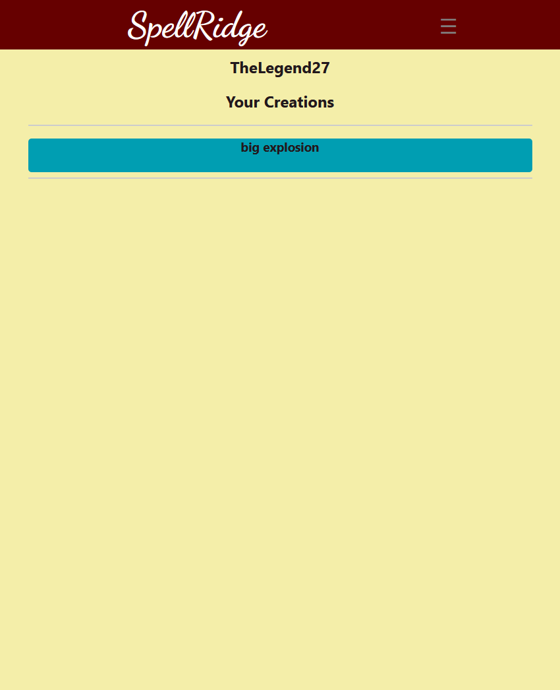
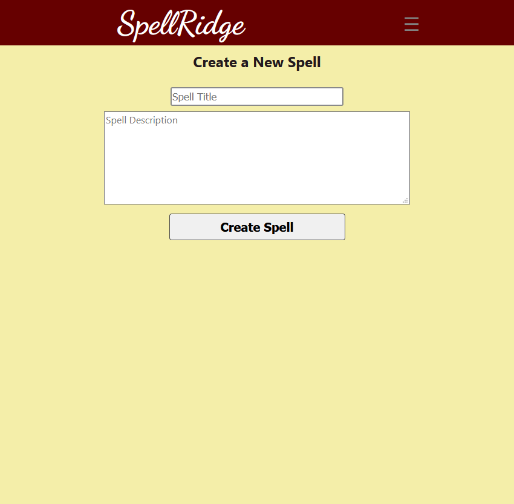

# SpellRigdge

## [Live Deployment](https://spellbound.vercel.app/)

Share your creativity! The SpellRidge app allows anyone to view spell ideas made by the community, as well as create their own spell ideas.

## Screenshots

## Stack
**This project was bootstrapped with create-react-app**\
*This is the front end for the full SpellBound Project. For the backend repo, go [here](https://github.com/s-poveda/spellbound-api)*\

* React

* React Router

***Deployed through [Vercel](https://vercel.com)***
